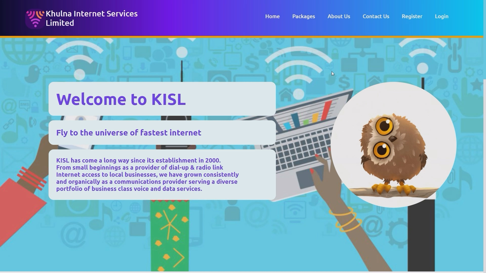

# Broadband Website - ASP.NET Core MVC

A comprehensive broadband/ISP (Internet Service Provider) management website built with ASP.NET Core 6.0 MVC. This project was developed as part of the Academic Course **CSE 3110: Web Programming Laboratory**.

## 📋 Project Overview

This is a full-stack web application that simulates an ISP service platform with user authentication, role-based authorization, message management, and administrative features. The platform allows users to browse services, submit inquiries, and enables administrators to manage users and roles.

## 🎥 Demo Video

**Watch the live demonstration** - Click the image below to view a compressed demo video showing all features:

[](demo_website_video_compressed.mp4)

> The demo video showcases user registration, login, contact form submission, role-based features, and admin dashboard functionality.

## 🛠 Technology Stack

### Frontend
- **HTML5** - Semantic markup across all pages
- **Vanilla CSS** - Custom styling throughout the application
- **Bootstrap 5** - Used specifically for login and authentication pages
- **Razor Views** - ASP.NET Core view engine for dynamic content

### Backend
- **ASP.NET Core 6.0 MVC** - Web framework and architecture
- **C#** - Server-side language
- **Entity Framework Core 7.0.5** - ORM for database operations
- **SQL Server** - Relational database
- **ASP.NET Identity** - Authentication and authorization framework

### Tools & Development Environment
- **Visual Studio 2022** - IDE used for development
- **SQL Server** - Database server

## ✨ Key Features

### Authentication & Authorization
- **User Registration & Login** - Secure account creation and authentication
- **Email-based Authentication** - User accounts managed via email addresses
- **Role-Based Access Control** - Two default roles: `Admin` and `User`
- **Session Persistence** - Login sessions persist even after browser closure
- **Default Admin Account** - Pre-configured admin account for system access

### Core Functionality
- **Contact Form** - Users can submit inquiries with Name, Email, and Query
- **Message Management** - View, edit, and delete submitted messages (role-restricted)
- **User Management** - Admin dashboard to manage user accounts
- **Role Management** - Admin panel for creating and assigning user roles
- **About Page** - Static content about the broadband services
- **Privacy Page** - Privacy policy information

### User Interfaces
- **Public Homepage** - Welcome page with service overview
- **Contact Page** - Form for customer inquiries
- **Admin Dashboard** - Role and user management interfaces
- **Authentication Pages** - Login, registration, and account recovery flows
- **Error Handling** - Custom error pages

## 📁 Project Structure

```
Broadband/
├── Controllers/
│   ├── HomeController.cs          # Homepage and main actions
│   ├── ContactController.cs       # Contact form handling
│   ├── UserMessagesController.cs  # Message management (CRUD)
│   ├── UsersController.cs         # User management (Admin)
│   ├── AppRoleController.cs       # Role management (Admin)
│   └── AboutController.cs         # About page
├── Models/
│   ├── UserMessage.cs             # Contact message model
│   ├── Login.cs                   # Login model
│   └── ErrorViewModel.cs          # Error handling
├── Views/
│   ├── Home/                      # Homepage views
│   ├── Contact/                   # Contact form views
│   ├── UserMessages/              # Message management views
│   ├── Users/                     # User management views
│   ├── AppRole/                   # Role management views
│   ├── About/                     # About page views
│   ├── Shared/                    # Shared layouts & partials
│   └── Areas/Identity/            # Authentication scaffolded pages
├── Data/
│   └── UserMessageDbContext.cs    # EF Core database context
├── Migrations/                    # Database schema migrations
├── wwwroot/
│   ├── css/                       # Stylesheets
│   │   ├── site.css               # Main styles
│   │   ├── style.css              # Additional styles
│   │   ├── login.css              # Login page styling
│   │   └── loginlayout1.css       # Login layout styles
│   └── lib/                       # Bootstrap library
├── Areas/
│   └── Identity/                  # ASP.NET Identity scaffolded pages
├── Program.cs                     # Application startup configuration
├── Broadband.csproj              # Project file
└── appsettings.json              # Configuration settings
```

## 🗄 Database

### Context: UserMessageDbContext
- Manages user messages and identity data
- Uses SQL Server as the database provider
- Connection string: `"Server=(localdb)\\mssqllocaldb;Database=ISP;Trusted_Connection=true;"`

### Key Tables
- **AspNetUsers** - User accounts (ASP.NET Identity)
- **AspNetRoles** - User roles
- **AspNetUserRoles** - User-role mappings
- **UserMessages** - Contact form submissions

### Database Migrations
- `20230613181430_InitialDb1` - Initial schema setup
- `20230617174241_OtherDeviceDb` - Additional device/schema updates

## 🔐 Authorization & Roles

### Available Roles
1. **Admin** - Full access to all administrative features
   - User management
   - Role management
   - View all messages
   
2. **User** - Limited access
   - Submit contact inquiries
   - Access public content

### Protected Pages
- `/AppRole/*` - Admin only (Role management)
- `/Users/*` - Admin only (User management)
- `/UserMessages/*` - Role-based access

## 🚀 Getting Started

This section guides you through the setup process to run the Broadband Website on your local machine.

### Prerequisites

Before you begin, ensure you have the following installed:

- **.NET 6.0 SDK** or later ([Download](https://dotnet.microsoft.com/download/dotnet/6.0))
- **SQL Server** - Choose one of:
  - SQL Server LocalDB (lightweight, included with Visual Studio)
  - SQL Server Express Edition (free, standalone)
  - Full SQL Server Edition
- **Visual Studio 2022** (or alternative: VS Code + .NET CLI)
- **Git** (for cloning the repository)

### Step-by-Step Installation

#### 1. Clone the Repository

Open Command Prompt or PowerShell and run:

```bash
git clone <repository-url>
cd Broadband
```

Replace `<repository-url>` with the actual GitHub repository URL.

#### 2. Verify .NET Installation

Confirm .NET 6.0 is installed:

```bash
dotnet --version
```

You should see version 6.0.x or higher.

#### 3. Configure Database Connection

The application uses SQL Server LocalDB by default. If you need to use a different SQL Server instance:

1. Open `Broadband/appsettings.json`
2. Locate the `ConnectionStrings` section:
   ```json
   "ConnectionStrings": {
     "ISP": "Server=(localdb)\\mssqllocaldb;Database=ISP;Trusted_Connection=true;"
   }
   ```
3. Modify the connection string if needed:
   - For **SQL Server Express**: `Server=localhost\\SQLEXPRESS;Database=ISP;Trusted_Connection=true;`
   - For **remote server**: `Server=your-server-name;Database=ISP;User Id=sa;Password=your-password;`

#### 4. Restore NuGet Packages

Navigate to the project directory and restore dependencies:

```bash
cd Broadband
dotnet restore
```

#### 5. Apply Database Migrations

Create the database and apply all migrations:

```bash
dotnet ef database update
```

This command will:
- Create the `ISP` database
- Create all required tables (Users, Roles, Messages, etc.)
- Automatically seed the default **Admin** role
- Automatically create the **Admin** user account

#### 6. Run the Application

Start the development server:

```bash
dotnet run
```

You should see output similar to:
```
Now listening on: https://localhost:5001
Now listening on: http://localhost:5000
Application started. Press Ctrl+C to quit.
```

#### 7. Access the Application

1. Open your web browser
2. Navigate to: `https://localhost:5001` (or the HTTP address shown in console)
3. The homepage should load successfully

### First Time Setup Verification

The application will automatically:
- ✅ Create the `Admin` and `User` roles
- ✅ Create the default admin account with credentials
- ✅ Set up the database schema

You're ready to use the application!

### Troubleshooting

**Issue:** "Cannot connect to database"
- **Solution:** Check the connection string in `appsettings.json`. Ensure SQL Server is running and accessible.

**Issue:** "dotnet command not found"
- **Solution:** Reinstall .NET SDK or add it to your system PATH.

**Issue:** Migrations failed to apply
- **Solution:** Verify your SQL Server instance is running. Try running `dotnet ef database drop` followed by `dotnet ef database update`.

**Issue:** Port already in use
- **Solution:** The application will use the next available port. Check the console output for the correct URL.


## 👤 Test Accounts

### Default Admin Account
- **Email:** `admin@gmail.com`
- **Password:** `test1234`
- **Role:** Admin

**Note:** Additional user accounts can be created through the registration page.

## 🔒 Password Policy

- Minimum length: 8 characters
- No special character requirements
- Case-insensitive
- Digits optional
- Uppercase/Lowercase optional

## 📝 Configuration Highlights

### Authentication Configuration (Program.cs)
- Cookie-based authentication
- Login path: `/Identity/Account/Login`
- Access denied path: `/Identity/Account/AccessDenied`
- Automatic role initialization on startup
- Automatic admin account creation on startup

### Identity Options
- Email confirmation: Not required
- Phone confirmation: Not required
- Account confirmation: Not required

## 📊 Features by User Type

### For Regular Users
- ✅ Browse website
- ✅ View services and information
- ✅ Submit contact form inquiries
- ✅ Manage account profile
- ✅ View privacy policy

### For Administrators
- ✅ All user features
- ✅ View all submitted messages
- ✅ Edit/Delete user messages
- ✅ Manage user accounts
- ✅ Create and manage roles
- ✅ Assign roles to users

## 🎓 Academic Context

This project was developed as part of **CSE 3210: Web Programming Laboratory** to demonstrate:
- MVC architectural pattern implementation
- User authentication and authorization
- Database design and Entity Framework Core usage
- RESTful API principles via controller actions
- HTML/CSS responsive design
- Razor view engine usage

## 📝 Notes

- The application includes automatic role and admin account seeding on startup
- Session cookies persist across browser sessions for convenience
- All database operations use Entity Framework Core with async/await patterns
- Bootstrap is selectively used only for authentication UI consistency
